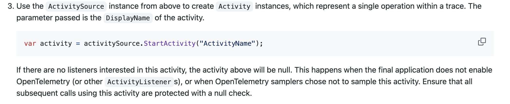

# telemetry-tracing
Блок по трассировкам

## 1. Подготовка приложения
В нашем приложении уже всё готово, чтобы отсылать трассировки, генерируемые при запросах.

Чтобы посмотреть, как они подключаются, обрати внимание на `OpenTelemetryExtensions.cs`. В этот раз мы будем использовать OpenTelemetry SDK, который, вообще, можно использовать и для логов с метриками.

Обрати внимание на метод AddSource - для автосгенерированных спанов он нам не нужен, но нужен для спанов, создаваемых вручную, впоследствии мы им воспользуемся.

Запусти приложение, пообновляй страницу. Так как мы подключили `AddConsoleExporter`, то в консоли приложения должна появиться информация о спанах.

## 2. Jaeger
В качестве сборщика спанов мы будем использовать Jaeger. До появления OpenTelemetry SDK он был #1 для отправки трассировок в .NET, сейчас же предпочтительнее использовать Otel, а Jaeger можно оставить как сборщик.

Со стороны приложения тоже всё настроено (`AddOtlpExporter`), запустим Jaeger. Проще всего воспользоваться одним из его Docker-образов, который включает всё, что нужно:

```bash
docker run --rm --name jaeger \           
-p 5778:5778 \
-p 16686:16686 \
-p 4317:4317 \
-p 4318:4318 \
-p 14250:14250 \
-p 14268:14268 \
-p 9411:9411 \
jaegertracing/jaeger:2.3.0 \
--set receivers.otlp.protocols.http.endpoint=0.0.0.0:4318 \
--set receivers.otlp.protocols.grpc.endpoint=0.0.0.0:4317
```

Версию можно выбрать свою (главное - в пределах второй мажорной), если не будет работать команда (например, может ругаться на параметр `-p`), воспользуйся этой версией:

```bash
docker run --rm --name jaeger -p 5778:5778 -p 16686:16686 -p 4317:4317 -p 4318:4318 -p 14250:14250 -p 14268:14268 -p 9411:9411 jaegertracing/jaeger:2.3.0 --set receivers.otlp.protocols.http.endpoint=0.0.0.0:4318 --set receivers.otlp.protocols.grpc.endpoint=0.0.0.0:4317
```

Теперь открой в браузере http://localhost:16686, открой приложение, выполни несколько запросов и нажми на кнопку `Search`. Посмотри, как выглядят трассировки в UI, поизучай данные, теги. Найди `CorrelationId`.

## 3. Кастомные спаны и теги
В .NET главный способ использовать кастомные спаны и теги — `Activity`, создаваемый с помощью `ActivitySource`. Правило хорошего тона - использовать один инстанс `ActivitySource` на приложение (но иногда может понадобиться несколько таких, для этого приходится писать обёртки). Есть ещё `ITracingProvider`, но с ним всё сложнее. В обычном случае всё просто: создаём `ActivitySource` через `new ActivitySource("MySource")` (опционально можно указать версию), создаём `Activity` через `using (var activity = source.StartActivity())` (или `using var`), оборачиваем в этот блок нужный нам кусок кода, опционально добавляем теги через `activity?.SetTag("key", "value")` (обрати внимание - `activity` может быть `null`!), можно ещё выполнить `activity?.Stop()`... но не с OpenTelemetry SDK. Причина на скрине (подробнее [здесь](https://github.com/open-telemetry/opentelemetry-dotnet/tree/main/src/OpenTelemetry.Api#introduction-to-opentelemetry-net-tracing-api)).



По умолчанию OpenTelemetry SDK не регистрирует никаких `ActivitySource` и `ActivityListener`'ов, поэтому и получаем `null`. Чтобы это исправить, и нужно использовать `AddSource("name")` в конфигурации трассировки.

Теперь попробуй добавить кастомный спан в трассировку. Для этого в обработчике запроса в `Program.cs` вытащи из параметров `ActivitySource` через `[FromServices] ActivitySource activitySource` и `SomeWorker` (`[FromServices] SomeWorker worker`).
Вызови worker.SomeWork() в обработчике и оберни код обработчика в `using var activity = activitySource.StartActivity("HelloWorld");`. Добавь в обработчик теги через `activity.AddTag("имя тега", "значение тега")`.

Запусти приложение, выполни запрос и посмотри (снова через кнопку поиска в Jaeger), что теперь в трассировке два спана.